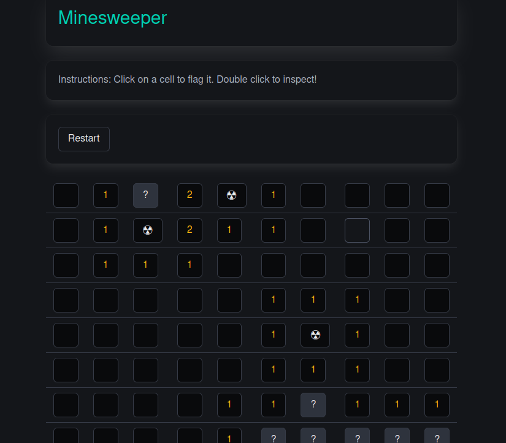

# Typescript Minesweeper

A simple Minesweeper game implemented with Typescript and React.

## Try it yourself

### Prerequisites

Install the latest version of git,nodejs, and npm.

### In a shell

1. git clone git@github.com:tubbeg/ts-minesweeper.git
2. cd ts-minesweeper
3. npm install
4. npx vite